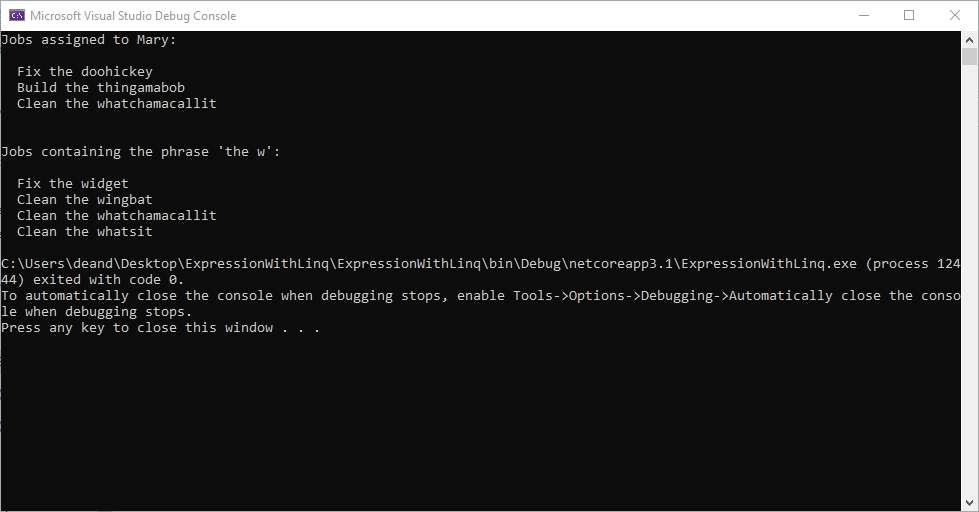
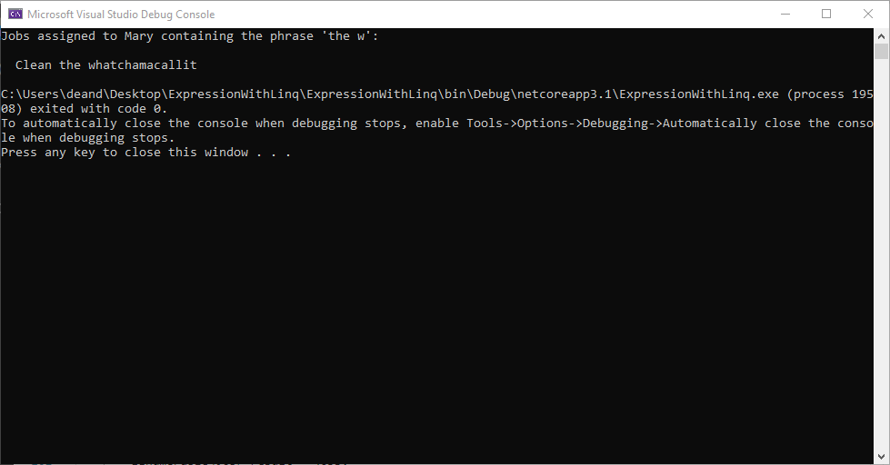
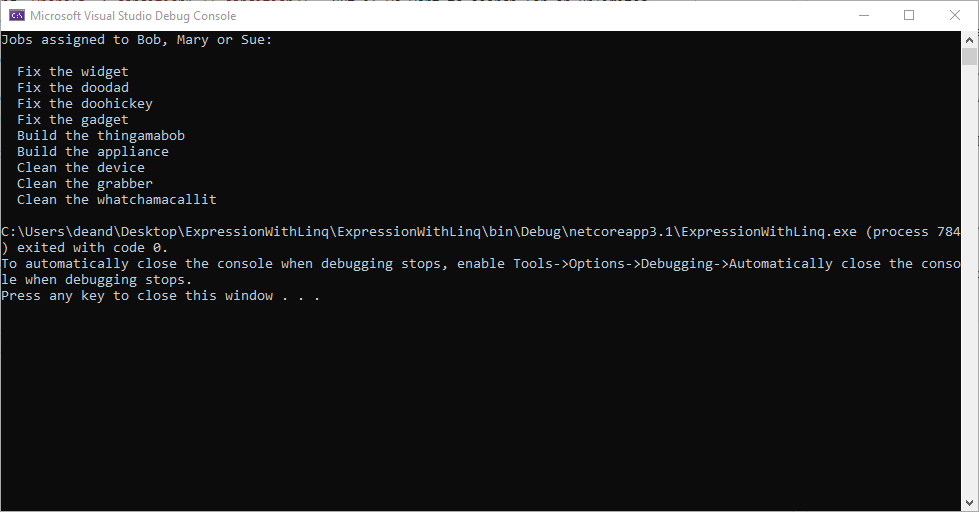
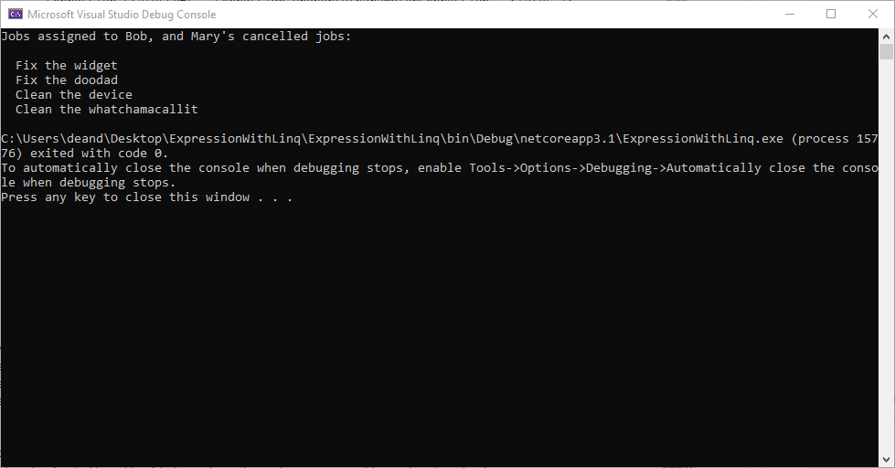

# Using Expression Object with Linq

*This blog post is based on a real-life scenario, but the details have been changed to
a more generic example which is not specific to the application I was building, and the examples
have been shown in a minimal program to focus on the relevant parts.*

## Background

In this blog, we are going to look at how to filter data in Linq using Expression objects.
Before we start, let's set up some data. I've created a new C# .Net Core 3.1 Console
Application. Within that application, I created a simple class to represent some data:

    class Job
    {
        public string JobNumber { get; set; }
        public string Description { get; set; }
        public string AssignedTo { get; set; }
        public Status Status { get; set; }
    }

Then, in the `Program.cs` file, I created some static data. In real life, the data is likely
to come from a database, but to keep this blog focused on the main topic, I'm creating some
static data that we can work with for the remainder of the blog:

    class Program
    {
        static readonly IReadOnlyList<Job> jobs = new List<Job>
        {
            new Job { JobNumber = "J00001", Description = "Fix the widget", AssignedTo = "Bob", Status = Status.Received },
            new Job { JobNumber = "J00002", Description = "Fix the doodad", AssignedTo = "Bob", Status = Status.Paid },
            new Job { JobNumber = "J00003", Description = "Fix the doohickey", AssignedTo = "Mary", Status = Status.Paid},
            new Job { JobNumber = "J00004", Description = "Fix the gadget", AssignedTo = "Sue", Status = Status.Complete },
            new Job { JobNumber = "J00005", Description = "Build the gizmo", AssignedTo = "John", Status = Status.Received },
            new Job { JobNumber = "J00006", Description = "Build the thingamabob", AssignedTo = "Mary", Status = Status.Paid },
            new Job { JobNumber = "J00007", Description = "Build the appliance", AssignedTo = "Sue", Status = Status.Processing },
            new Job { JobNumber = "J00008", Description = "Clean the device", AssignedTo = "Bob", Status = Status.Received },
            new Job { JobNumber = "J00009", Description = "Clean the wingbat", AssignedTo = "John", Status = Status.Paid },
            new Job { JobNumber = "J00010", Description = "Clean the grabber", AssignedTo = "Sue", Status = Status.Paid },
            new Job { JobNumber = "J00011", Description = "Clean the whatchamacallit", AssignedTo = "Mary", Status = Status.Cancelled},
            new Job { JobNumber = "J00012", Description = "Clean the whatsit", AssignedTo = "Jane", Status = Status.Complete },
        }.AsReadOnly();

## Querying the Data

We are mostly familiar with using Linq to query data, but in case you need a reminder, I created
two query methods, and then I invoked each of them in the `Main()` method:

    static void Main(string[] args)
    {
        Console.WriteLine("Jobs assigned to Mary:" + Environment.NewLine);
        foreach (var job in GetJobsByPerson("Mary"))
        {
            Console.WriteLine("  " + job.Description);
        }

        Console.WriteLine(Environment.NewLine);

        Console.WriteLine("Jobs containing the phrase 'the w':" + Environment.NewLine);
        foreach (var job in GetJobsByDescription("the w"))
        {
            Console.WriteLine("  " + job.Description);
        }
    }

    static IEnumerable<Job> GetJobsByPerson(string person)
    {
        return jobs.Where(j => j.AssignedTo == person);
    }

    static IEnumerable<Job> GetJobsByDescription(string search)
    {
        return jobs.Where(j => j.Description.Contains(search));
    }

The output from this program is as follows:

## Combining Search Criteria Dynamically

I often find that I need to combine two or more search criteria together, and return
only the data where condition 1 **and** condition 2 are *both* true. This is very
easy to do using Linq, with a call to `Where()` such as `Where(j => condition1 && condition2)`.
But what if we need to decide, dynamically, whether each of the search criteria should be
included or not?

Because we can apply Linq methods such as `Where()` to any kind
of `IEnumerable`, and because `Where()` returns an `IEnumerable`, we can take the result
from one call to `Where()` and then call `Where()` on that result. The end result will
be only the data where both of the conditions are true. We can then wrap each call to
`Where()` inside an `if` to dynamically choose which criteria to use.

I added an example of this to my program:

    static void Main(string[] args)
    {
        Console.WriteLine("Jobs assigned to Mary containing the phrase 'the w':" + Environment.NewLine);
        foreach (var job in GetJobsByPersonAndDescription("Mary", "the w"))
        {
            Console.WriteLine("  " + job.Description);
        }
    }

    static IEnumerable<Job> GetJobsByPersonAndDescription(string person, string descriptionSearch)
    {
        IEnumerable<Job> result = jobs;
            
        if (person != null)
        {
            result = result.Where(j => j.AssignedTo == person);
        }
            
        if(descriptionSearch != null)
        {
            result = result.Where(j => j.Description.Contains(descriptionSearch));
        }

        return result;
    }

The results from this are as follows:

## Finding Data Using Contains (A Form Of Logical Or)

The preceeding technique combines together search criteria using a logical "and" - it returns data
where both the first condition *and* the second condition are true.

Next, we will see how to combine data where a particular property has either Value A *or* Value B,
using a logical "or". Using a logical "or" with just two conditions is again a straightforward
case of writing `Where(j => condition1 || condition2)`. But if we want to search for an unknown,
dynamic number of phrases, we can do this using `Contains()`, as I've shown here:

    static void Main(string[] args)
    {
        Console.WriteLine("Jobs assigned to Bob, Mary or Sue:" + Environment.NewLine);
        foreach (var job in GetJobsByPerson("Bob", "Mary", "Sue"))
        {
            Console.WriteLine("  " + job.Description);
        }
    }

    static IEnumerable<Job> GetJobsByPerson(params string[] people)
    {
        return jobs.Where(j => people.Contains(j.AssignedTo));
    }

And the results:

Notice the use of the `params` keyword in the parameter to the new method. This allowed
the method to take an unlimited number of parameters, which are then combined into
an array. We use the Linq's `Contains()` method to search the array. When we invoke the
method, we don't need to create an array - we just list out our arguments, and C# creates
the array for us.

## Dynamically Building Search A Criteria Expression

In a project I was doing recently, I had some code similar to the example above, where I was using
`Contains()` to search my data. A new requirement then came in, which was to be able to search
for jobs assigned to a particular person, with (optionally for each person) a particular status.

My first attempt at solving this involved chaining methods together, in a similar way to
what we did earlier when we chained two `Where()` calls together. But it very quickly became
apparent that chaining methods would not work in this scenario - chaining `Where()` calls
always combines the conditions using a logical and, *not* a logical or.

And so I was forced to build my search criteria in a more long-winded way.

Rather than jump straight to the solution, what I'd like to do first is show you how to
re-write the above example using an `Expression` object. This is someting you won't want to do
in real life, because using the `Contains()` method is so much easier, but it's an essential
step en route to solving the problem.

Traditionally, when we call `Where()`, we pass a parameter which is a lambda - an in-line
function which was created at compile-time, which is used to choose which data to include in
the results.

But to solve this particular problem, it's not possible to create such a lambda, because
it can not be built at compile time. If we use the logical or `||` sign to build our lambda,
we will run into problems because we don't know how many Boolean expressions we have to combine
together. And although the `Contains()` method works in simple cases, it doesn't work when we
need to check more than one field (well, there are ways of making it work, but they don't translate
well to Linq-to-Entity Framework).

So instead, we are going to create an `Expression` object which takes the place of the lambda.
I have added a `using` statement to include the `System.Linq.Expressions` namespace for this
example.

Let's show the code first, and then we'll explain how it works:

    static void Main(string[] args)
    {
        Console.WriteLine("Jobs assigned to Bob, Mary or Sue:" + Environment.NewLine);
        foreach (var job in GetJobsByPersonWithExpression("Bob", "Mary", "Sue"))
        {
            Console.WriteLine("  " + job.Description);
        }
    }

    static IEnumerable<Job> GetJobsByPersonWithExpression(params string[] people)
    {
        if (people == null || people.Length == 0)
        {
            // If no list of people is included, return an empty list
            return new List<Job>().AsEnumerable();
        }

        ParameterExpression parameterExpression = Expression.Parameter(typeof(Job));
        Expression peopleExpression = null;
        foreach (var person in people)
        {
            // Build an expression to check for this person
            Expression left = Expression.Property(parameterExpression, "AssignedTo");
            Expression right = Expression.Constant(person);
            Expression equals = Expression.Equal(left, right);

            // Combine the expression for this person with the expression for all the other
            // people, using a logical Or
            if (peopleExpression == null)
            {
                peopleExpression = equals;
            }
            else
            {
                peopleExpression = Expression.OrElse(peopleExpression, equals);
            }
        }

        // Now use the expression we've built to return the results we need
        var lambda = (Expression<Func<Job, bool>>) Expression.Lambda(peopleExpression, parameterExpression);
        return jobs.AsQueryable().Where(lambda);
    }

At the start of this new method, we first of all check that we have some people to search for,
and if not we just return an empty list of jobs.

Once that check is out of the way, we begin to build a lambda expression. The lambda is going to
be of type `Func<Job, bool>` - a function which takes a `Job` as a parameter, and returns a `bool` to
indicate whether this job is to be included. So the first step is to create a variable of type
`ParameterExpression` which represents the parameter that the lambda will receive, i.e. the `Job`
object. We also create an `Expression` variable which will eventually contain our complete
expression, but initially we set it to null.

Now we've set everything up, we can loop through each name in turn. For each name, we build
a very straightfoward expression: `j.AssignedTo == person`. On the left of the == sign is a
property of the job object, so we use `Expression.Property()` to create an expression to represent
this. And on the right is a constant (it's not a constant in the C# context of the word, because
its value will change each iteration of the loop, but it's a constant within the expression - we
set its value as we create the expression, and its value does not change for the life of the
expression), so we use `Expression.Constant` to create an expresion for the right hand side.
To combine the left and the right hand sides together, we put a == between them, and the way
to do this with dynamic expressions is to use `Expression.Equal()`.

Now we have an expression for this person, so the next job - assuming this is not the first person -
is to combine it with the expressions for all the previous people, using a logical or. We use
`Expression.OrElse()` to do this. (You might be wondering why we write OrElse instead of simply
Or. The reason is that OrElse includes short-circuiting, and Or does not.)

At the end of the loop, we have our completed expression. But we need to use the expression
to create a lambda. The lambda takes a parameter, so when we call `Expression.Lambda()` we have
to pass our `ParameterExpression` object as well as the expression itself. And we also have
to cast the result to the correct type, because `Expression.Lambda()` is not a generic method,
so the compiler has no way of knowing what its exact return type is.

The final hurdle we have in this step is to understand the difference between an `IEnumerable`
and an `IQueryable`. `IQueryable` implements `IEnumerable`, so there is a lot of similarity
between them, but Linq has the ability to work with `IQueryable` objects in ways it can't do
with `IEnumerable` objects. One of the key differences is the ability to use Expressions -
we can't do that unless we use `AsQueryable()` to change our collection into a queryable
collection first.

## Adding Multiple Parts To The Condition

As I said earlier, using an Expression as I've shown above is not very useful, because
it would be much easier to use `Contains()`. But now that we've got the framework of the
Expression in place, we can make it more complex, in ways which `Contains()` would not be
able to do.

You may recall that I had a need to search my jobs for combinations of people and the job
status.

I started by creating an object which represented the search criteria:

    class JobSearchCriteria
    {
        public string AssignedTo { get; set; }
        public Status? Status { get; set; }
    }

Then, I modified my search method so that it took as a parameter an array of these objects,
instead of an array of string:

    static IEnumerable<Job> GetJobs(params JobSearchCriteria[] criteria)
    {
        ...
    }

And a small modification to the way we build the Expression object will now meet our
final, complete requirements:

    static void Main(string[] args)
    {
        Console.WriteLine("Jobs assigned to Bob, and Mary's cancelled jobs:" + Environment.NewLine);
        foreach (var job in GetJobs(
            new JobSearchCriteria { AssignedTo = "Bob" },
            new JobSearchCriteria { AssignedTo = "Mary", Status = Status.Cancelled} ))
        {
            Console.WriteLine("  " + job.Description);
        }
    }

    static IEnumerable<Job> GetJobs(params JobSearchCriteria[] criteria)
    {
        if (criteria == null || criteria.Length == 0)
        {
            // If no list of people is included, return an empty list
            return new List<Job>().AsEnumerable();
        }

        ParameterExpression parameterExpression = Expression.Parameter(typeof(Job));
        Expression peopleExpression = null;
        foreach (var criterion in criteria)
        {
            // Build an expression to check for this person
            Expression personLeft = Expression.Property(parameterExpression, "AssignedTo");
            Expression personRight = Expression.Constant(criterion.AssignedTo);
            Expression personEquals = Expression.Equal(personLeft, personRight);

            Expression match;

            if (criterion.Status == null)
            {
                match = personEquals;
            }
            else
            {
                // Build an expression to check for this status
                Expression statusLeft = Expression.Property(parameterExpression, "Status");
                Expression statusRight = Expression.Constant(criterion.Status);
                Expression statusEquals = Expression.Equal(statusLeft, statusRight);

                // And combine the two together using a local And
                match = Expression.AndAlso(personEquals, statusEquals);
            }

            // Combine the expression for this person with the expression for all the other
            // people, using a logical Or
            if (peopleExpression == null)
            {
                peopleExpression = match;
            }
            else
            {
                peopleExpression = Expression.OrElse(peopleExpression, match);
            }
        }

        // Now use the expression we've built to return the results we need
        var lambda = (Expression<Func<Job, bool>>)Expression.Lambda(peopleExpression, parameterExpression);
        return jobs.AsQueryable().Where(lambda);
    }

You'll notice that most of the code here is similar to the previous example, but I've added
some code to check whether the Status of each criterion is null, and, if not, to use
`Expression.AndAlso()` (again, the long form gives a short-circuiting logical and) to combine
this extra test before this criterion is combined with the others.

The results are shown below. Check this against our status data to ensure that it has given
the results we'd expect:

## Notes About IQueryables And Entity Framework

In this blog, we saw how Expressions can be used to filter query results, but we had to
convert our data collection to an `IQueryable` before we could do that.

One of the main places where you will find `IQueryable` data types is in Entity Framework,
where the `DbSet<>` generic collection type implements the `IQueryable<>` interface. This
is an essential part of how Entity Framework functions. If Entity Framework exposed a plain
`IEnumerable` to us, we would be able to use lambdas to filter the data, but *not* Expression
objects. Lambdas can't be parsed by Entity Framework and turned into SQL, so the result
is that the data filtering would happen on the client, not the server.

By ensuring that `DbSet<>` implements `IQueryable<>`, Entity Framework can ensure that
Linq methods such as `Where()` receive an Expression, and not a lambda. We can still write
a lambda in our code, and the compiler converts it to an Expression at compile time.
Entity Framework is then able to parse the contents of the Expression and turn it into
(hopefully efficient) SQL.

Therefore, if your data set is a `DbSet<>`, as it often will be in real life, you can
omit the call to `AsQueryable()` because your data set will already be queryable.

## Conclusion

In this blog, I have shown you how to use Expression objects to dynamically build
complex search criteria at run time. This technique is sometimes needed when the system
requirements involve searches which require the use of logical "or" expressions, and
when it's not possible to specify the search criteria at compile time. I hope you find
it useful.

### About The Author

Dean Dashwood's career has involved long stretches of writing computer software, interspersed
with periods working as a pilot and as a computer programming tutor. He specialises in
Microsoft technologies, including C# and SQL Server.